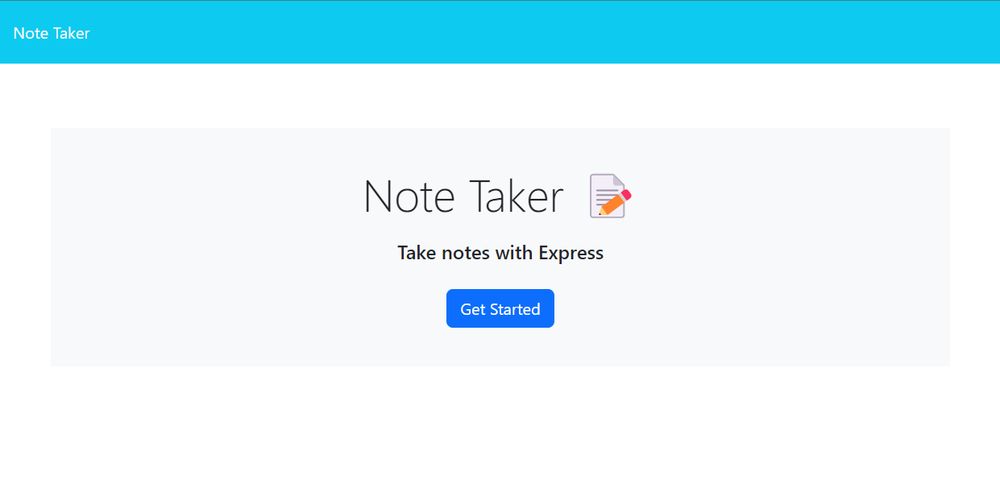
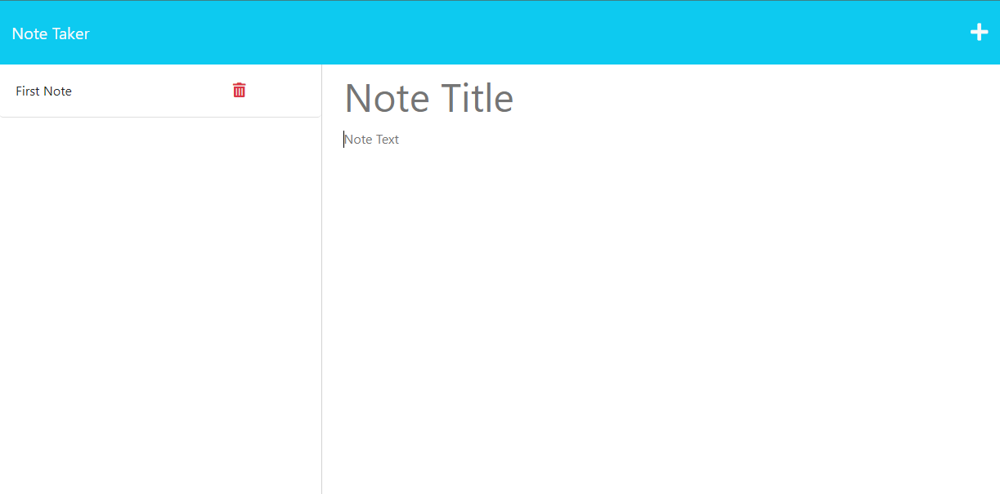
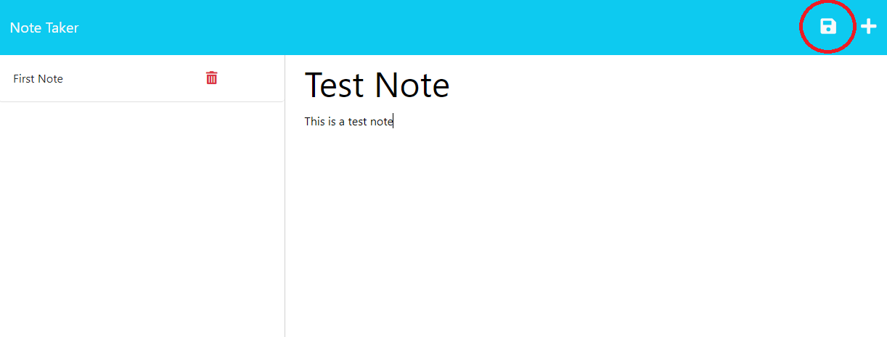
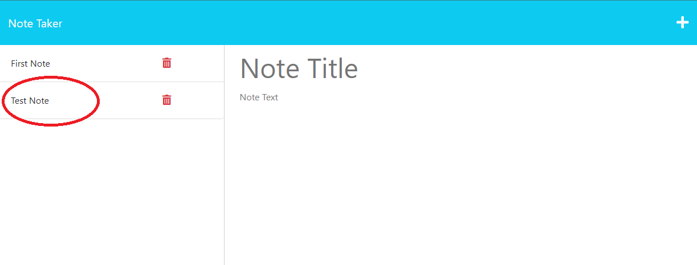

# POTENTIAL-PANCAKE

## Description

This is a Note Taker application. Users can save and view personal notes within the server. They can choose to delete any note they may not need. All notes will be displayed on the left side of the page.

Link to application: https://potential-pancake-53c745f69bf6.herokuapp.com/

## Installation

N/A

## Usage

The page will greet the user with the home screen. Click "Get Started" to go to your notes page.

-Click the "+" at the top of the screen to start adding a new note.
-Fill out title and text fields, click the save icon at the top of the screen to save the note.

The User can click the trash can next to the note to delete the note.

## License 
Visit [GPL License](https://www.gnu.org/licenses/gpl-3.0) for all information about this license

## How to Contribute

N/A

## Questions

For any questions, please contact me:

- GitHub: [imshocker](https://github.com/imshocker)